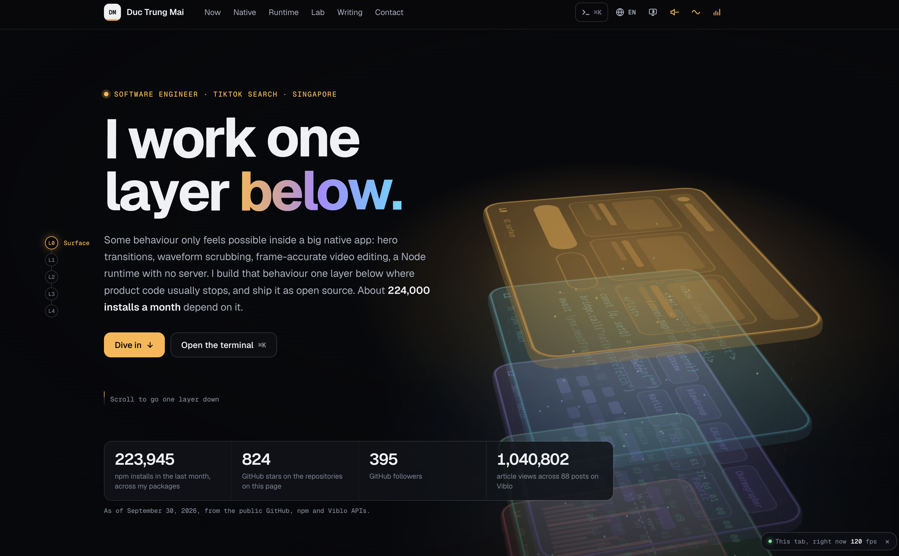

# ducmai.me

<div align="center">
  
</div>

Source of [ducmai.me](https://ducmai.me): "Layer Dive". The page is a stack of five layers, from the
UI down to frames, and scrolling moves you down through them.

| Layer | Section | Stack |
| --- | --- | --- |
| L0 | Hero | UI |
| L1 | Now | React Native |
| L2 | Native | Swift, Kotlin |
| L3 | Runtime | C, Rust to Wasm |
| L4 | Lab | GPU, frames |

Writing, the career timeline and contact sit below L4.

## Quick start

```sh
npm ci
npm run dev        # http://localhost:4321, listens on all interfaces
npm run build      # fetches stats, then builds static HTML into dist/
npm run preview    # serves dist/
npm run check      # astro check (types and templates)
```

Node 22.12 or newer.

## Architecture

- **Astro, static output.** Every locale is plain HTML at build time. The headline, copy and numbers
  are all in the document, so the largest contentful paint is text and never waits for JavaScript.
- **One small entry script** (`src/scripts/main.ts`, about 8 KB gzip) handles preferences, section
  tracking, reveals and lazy loading. Everything else is a separate chunk loaded on demand:
  - the Three.js scene, after the browser goes idle
  - each demo, when it scrolls near the viewport
  - the palette, on first open
  - the HUD, when it is switched on
  - the synth, when sound is switched on
- **Three.js scene** (`src/scripts/scene/`). Five extruded slabs with procedurally painted canvas
  textures, packets falling between them and a camera that dives with scroll. There are no model or
  texture downloads. It renders on demand, and runs continuously only while the hero is visible, a
  transition is in flight or the pointer has just moved. It stops when the tab is hidden.
- **Scroll is never hijacked.** A probe at 45% of the viewport decides the current layer. The page
  scrolls natively and the scene follows.

```
src/
  config/headline.ts     the hero line, one value per locale, plus alternatives
  i18n/                  en.ts (source dictionary), vi.ts, helpers
  data/                  stats snapshot, stats helpers, project list
  layouts/Base.astro     head, SEO, JSON-LD, inline preference script
  components/            Nav, Stage, Depth, Home (all sections), Palette, Hud, Footer
  pages/                 index, vi/, 404, sitemap.xml, robots.txt
  scripts/               main, stage, scene/, demos/, palette, hud, sound, synth, store
  styles/global.css
scripts/
  fetch-stats.mjs        build-time GitHub, npm and Viblo numbers
  make-og.mjs            renders public/og/{en,vi}.png
  smoke.mjs              Playwright smoke test
```

## The headline

The hero line lives in one place, `src/config/headline.ts`, with one value per locale. After first
paint (and only with motion on) `src/scripts/kinetic.ts` splits it into graphemes inside nowrap word
boxes, so line breaks and height stay identical, and letters react to the pointer or a finger with a
spring. The `<h1>` keeps the full text as its accessible name. The `<h1>`,
the page title, the terminal's `whoami` and the OG cards all read it. After changing it, regenerate
the cards:

```sh
CHROMIUM_PATH=/path/to/chrome npm run og
```

## Languages

English at `/`, Vietnamese at `/vi/`. `src/i18n/en.ts` is the source dictionary and its type is
the contract: `vi.ts` must provide every key, so a missing
translation fails `astro check`. Each page has its own title, description, canonical URL, `hreflang`
alternates, OG image and JSON-LD. The language menu keeps the current section anchor.

## Stats

Numbers on the page (stars, npm downloads, Viblo views) come from public APIs at build time.

- `npm run build` runs `fetch-stats.mjs` first. It writes `src/data/stats.live.json`, which git ignores.
- Any source that fails falls back to `src/data/stats.snapshot.json`, which is committed, so the build
  never breaks because of an API. The page shows the "as of" date of the data it used.
- `npm run stats:snapshot` refreshes the committed snapshot. It only writes when every source
  answered with plausible, non-empty data.
- `.github/workflows/refresh-stats.yml` does that every Monday at 00:17 UTC: it commits the new
  snapshot to `bot/refresh-stats`, opens (or updates) one PR, merges it, and dispatches the deploy.
  It needs "Allow GitHub Actions to create and approve pull requests" ticked under Settings, Actions,
  General. If `master` requires reviews, the PR is queued for auto-merge instead of merged.
- `STATS_OFFLINE=1` skips the network entirely. `GITHUB_TOKEN`, if set, only raises the rate limit.

## Preferences

All preferences are stored in `localStorage` under `dm:*`. A tiny inline script in `<head>` applies
them before the first paint, so the theme never flashes.

- **Theme**: system, light or dark. The scene, HUD and `theme-color` follow it.
- **Motion**: follows `prefers-reduced-motion` until you choose. With motion off, the stage becomes a
  static illustration and the demos stop animating on their own.
- **Sound**: on by default, with a toggle in the nav and the footer. Browsers only allow audio after
  a click or key press, so nothing plays before the first one. All sounds are generated with Web Audio: hover,
  click, layer changes (the pitch drops as you go deeper), keystrokes in the terminal, the shared-hero
  demo's open, close and spring-back, a pentatonic note per headline letter, and toggles. The
  `AudioContext` is only created after a user gesture. Until then the nav icon breathes; once audio is
  live it becomes a three-bar visualizer fed by an `AnalyserNode`, animating only while something is
  audible. On a first visit with no saved preference, a hint by the sound button (a bottom pill on
  phones) offers a test chord or mute, closes on Esc or after 8 s, and never returns
  (`dm:soundHint`).
- **HUD**: frame rate, p95 frame time and refresh rate of your own display, with an `Inject jank`
  button that blocks the main thread for three seconds. On by default at 1100 px and wider, as a
  small pill that expands on click.

## Fallbacks

The stage has three modes. The first applicable one wins:

1. **static**: reduced motion, or motion switched off. The server-rendered CSS stack, not animated.
2. **css**: no WebGL, `saveData`, under 4 GB device memory or under 4 CPU cores. The same CSS stack
   with CSS parallax and the dive.
3. **webgl**: the Three.js scene. The CSS stack stays visible until the first frame is ready.

While running, the scene measures its median frame time. When frames run long it steps down from
high to medium to low (pixel ratio, packets, halos). If that is still not enough, or the WebGL context
is lost, it gives up and hands over to the CSS stack.

## The terminal

`⌘K` or `Ctrl K` (or `/`) opens a command palette. Pick an entry, or type a shell command. `help`
lists them. There are a few easter eggs; `sudo hire me` is the useful one.

## Development behind a proxy

The dev server listens on all interfaces (`server.host: true`) on port 4321 and accepts any `Host`
header. When the page is served through an HTTPS proxy, point hot reload at the public address:

```sh
ASTRO_HMR_HOST=dev.example.com ASTRO_HMR_CLIENT_PORT=443 ASTRO_HMR_PROTOCOL=wss npm run dev
```

## Smoke test

```sh
npm run build && npm run preview &
SMOKE_URL=http://localhost:4321 SMOKE_SHOTS=screens CHROMIUM_PATH=/path/to/chrome npm run smoke
```

The smoke test covers every locale in light and dark, at 390 px and 1440 px, plus one reduced-motion
run. It fails on any console error or horizontal overflow, exercises the demos, palette and theme
toggle, and saves a screenshot of each run.

## Deploying

`.github/workflows/deploy-pages.yml` builds the site and publishes `dist/` to GitHub Pages. It does
not upload `dist/` as-is. Every file must match an allowlist of web asset types (`PUBLISH_PATTERNS`),
or the build fails. A second check rejects any Markdown, source map or `docs/` path. A new kind of file
cannot reach the web until somebody widens the allowlist on purpose.

It runs on every push to `master` and on demand. The weekly stats job dispatches it explicitly,
because a merge made with the workflow's own `GITHUB_TOKEN` does not trigger other workflows.

## Typefaces

Geist and Geist Mono, both variable, from the Geist project, used under the SIL Open Font License.
Each is self-hosted as three woff2 subsets, selected by `unicode-range` so a page only downloads
what it renders: Latin, Vietnamese, and arrows (`→ ↗`, plus `⏎` for Mono). The Vietnamese and arrow
files were cut from the `geist` npm package (1.7.2) with fontTools:

```sh
python3 -m fontTools.varLib.instancer GeistMono-Variable.ttf wght=400:600 -o mono.ttf
python3 -m fontTools.subset mono.ttf --unicodes="U+0102-0103,U+0110-0111,U+0128-0129,U+0168-0169,U+01A0-01A1,U+01AF-01B0,U+0300-0301,U+0303-0304,U+0308-0309,U+0323,U+0329,U+1EA0-1EF9" \
  --layout-features='*' --flavor=woff2 --no-hinting --output-file=public/fonts/geist-mono-vi.woff2
```

The GitHub star and the terminal prompt are inline SVG. The few symbols Geist does not draw (`✓ ✕ ⌘`)
fall back to the system font.
